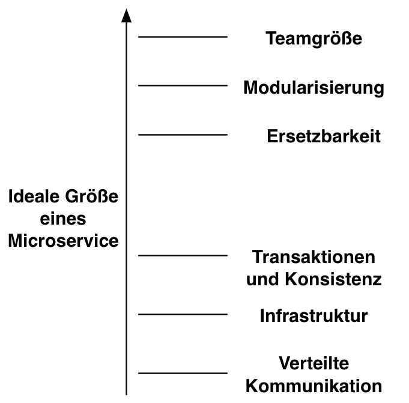
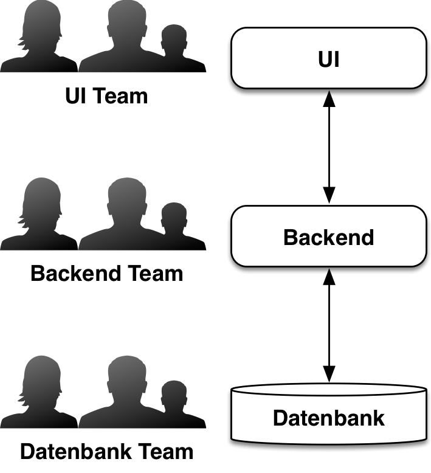
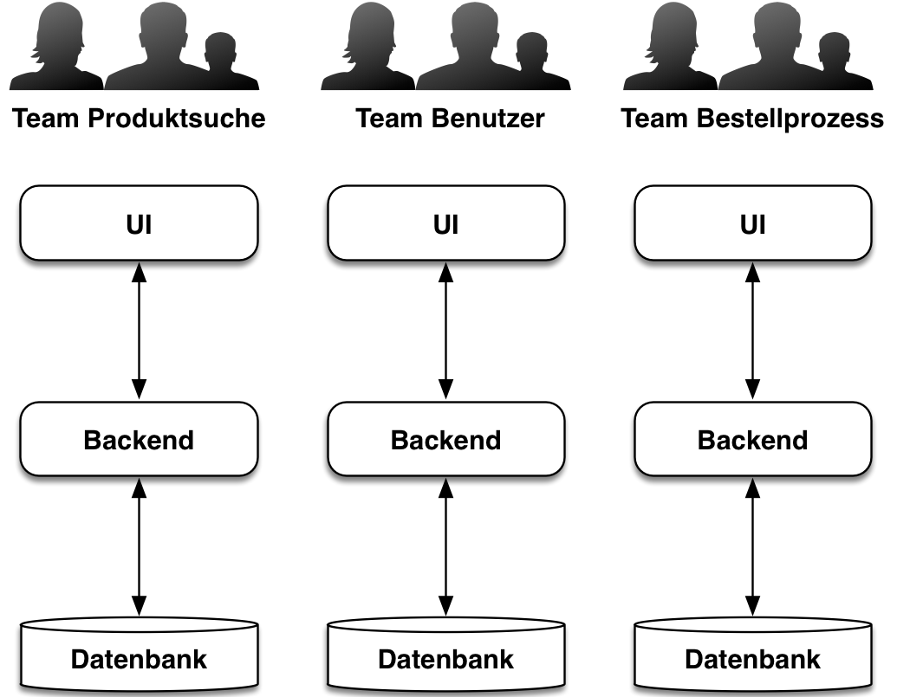

# 2 Was sind Microservices? {#chapter2}

Die Idee der Microservices[^MS] ist nicht neu. Einen ganz ähnlichen Ansatz
verfolgt schon die UNIX Philosophie. Sie basiert auf drei Ideen:

[^MS]: Eberhard Wolff: Microservices - Grundlagen flexibler Softwarearchitekturen, dpunkt Verlag, 2015, ISBN 978-3864903137

* Ein Programm soll nur eine Aufgabe erfüllen --- die dafür sehr gut.

* Die Programme sollen zusammenarbeiten können.

* Außerdem sollen die Programme eine universelle Schnittstelle
nutzen. In UNIX sind das Textströme.

Dadurch entstehen wiederverwendbare Programme - letztendlich eine Art
Komponenten.

Microservices dienen dazu, große Systeme aufzuteilen. Damit sind
Microservices ein Modularisierungskonzept. Es gibt viele
Modularisierungskonzepte, aber Microservices sind anders. Sie können
unabhängig voneinander in Produktion gebracht werden. Eine Änderung an
einem Microservice bedeuten, dass nur dieser Microservices in
Produktion gebracht werden muss. Bei anderen Modularisierungskonzepten
müssen alle Module gemeinsam ausgeliefert werden. Eine Änderung an
einem Modul erfordert dann ein erneutes Deployment der gesamten
Anwendung mit allen Modulen.

#### Microservice = virtuelle Maschine

Microservices können nicht mit den Modularisierungskonzepten der
Programmiersprachen umgesetzt werden. Denn diese Konzepte erfordern,
dass alle Module zusammen in einem Programm
ausgeliefert werden. Stattdessen müssen Microservices als virtuelle
Maschinen, leichtgewichtigere Alternativen wie Docker-Container oder
einzelne Prozesse umgesetzt werden. Nur dann  können sie
einzeln in Produktion gebracht werden.

Daraus ergeben sich weitere Vorteile: So sind Microservices
nicht an eine bestimmte Technologie gebunden. Sie können in jeder
Programmiersprache oder mit jeder Plattform implementiert sein. Und
natürlich
können Microservices eigene Unterstützungsdienste wie Datenbanken
oder andere Infrastruktur mitbringen.

Microservice sollen getrennte Datenhaushalte haben. Jeder
Microservice ist also Herr über seine Daten. Die Erfahrung lehrt,
dass die gemeinsame Nutzung von Datenbank-Schemata Änderungen
an den Datenstrukturen praktisch unmöglich machen. Das behindert die
Änderbarkeit von Software so stark, dass Microservices diese Art der
Kopplung
ausschliessen.

#### Kommunikation zwischen Microservices

Microservices müssen miteinander kommunizieren können. Dazu sind
unterschiedliche Ansätze möglich:

*	Die Microservices können Daten *replizieren*. Gemeint ist damit
     nicht  das Kopieren der Daten ohne Änderung des
     Schemas. Dann sind Änderungen an dem Schema unmöglich, weil
     mehrere Microservices dasselbe Schema nutzen. Wenn aber ein
     Microservice Bestellungen verwaltet und ein anderer die Daten der
     Bestellungen analysiert, sind Datenformate 
     und Zugriffe unterschiedlich: Die Analyse liest
     die Daten vor allem, für die Verwaltung der Bestellungen sind
     Lesen und Schreiben eher gleichberechtigt. Auch klassische
     Datawarehouses arbeiten mit Replikation für die Analyse großer
     Datenmengen.
	 
* Wenn Microservices eine HTML-UI haben, können sie *Links*
     auf anderen Microservices nutzen. Es ist außerdem möglich, dass
     ein Microservice HTML-Code anderer Microservices integriert.
	 
*	Schließlich können die Microservices mit Protokollen wie *REST* oder
   *Messaging* über das Netzwerk miteinander kommunizieren.

In einem Microservice-System muss definiert werden, welche
Kommunikationsvarianten genutzt werden, um zu garantieren, dass die
Microservices auch mit diesen Technologien erreicht werden könne.

## 2.1 Größe {#section2-1}

Der Begriff "Microservice" stellt die Größe eines Microservices in den
Mittelpunkt. Das ist zur Abgrenzung gegenüber anderen
Service-Begriffen auch sinnvoll. Aber die konkrete Größe eines
Microservices anzugeben, ist gar nicht so einfach. Schon die Einheit
ist ein Problem: Lines of Code (LoC, Codezeilen) sind keine gute
Einheit. Schließlich hängt die Anzahl der Zeilen eines Programms nicht
nur von der Formatierung, sondern auch von der Programmiersprache
ab. Überhaupt ist es wenig sinnvoll, einen Architekturansatz mit
solchen Maßzahlen zu bewerten. Schließlich kann die Größe eines
Systems kaum sinnvoll absolut angegeben werden, sondern nur im
Verhältnis zu den abgebildeten Geschäftsprozessen und ihrer
Komplexität.

Daher ist es besser, die Größe eines Microservices anhand von
oberen und unteren Grenzen zu definieren. Für Microservices gilt
eigentlich, dass kleiner besser ist:

* Ein Microservice sollte von einem *Team* weiterentwickelt
  werden. Daher darf ein Microservice auf keinen Fall so groß sein,
  dass mehr als ein Team an ihm entwickeln muss.
  
* Microservices sind ein Modularisierungsansatz. Entwickler sollten
  einzelne *Module* verstehen können - daher müssen Module und damit
  Microservices so klein sein, dass sie ein Entwickler noch verstehen
  kann.

* Schließlich soll ein Microservice *ersetzbar* sein. Wenn der
  Microservice nicht mehr wartbar ist oder eine
  leistungsfähigere Technologie genutzt werden soll, kann der
  Microservice durch eine neue Implementierung ausgetauscht
  werden. Microservices sind der einzige Ansatz, der bereits bei
  der Entwicklung die Ablösung des Systems oder zumindest von Teilen
  des Systems betrachtet.

{id="Abb1"}

Die Frage ist , warum man Microservices nicht möglichst klein
baut. Schließlich verstärken sich die Vorteile, wenn die Microservices
besonders klein sind. Aber es gibt Gründe, warum sehr
kleine Microservices nicht so ohne weitere möglich sind:

* *Verteilte Kommunikation* zwischen Microservices über das Netz ist
aufwändig. Wenn die Microservices größer sind, ist die Kommunikation
eher lokal in einem Microservice und damit weniger aufwändig.

* Das *Verschieben von Logik* über die Grenzen von Microservices hinweg
  ist schwierig. Der Code muss in ein anderes System bewegt
  werden. Wenn das System eine andere Technologie oder
  Programmiersprache nutzt, kann eine Neuimplementierung des Codes die
  einzige Möglichkeit sein, um Funktionalität in den anderen
  Microservice zu bringen. Natürlich ist es auch immer möglich, aus
  den Funktionalitäten einen eigenen Microservice zu machen, auf den
  dann die anderen Microservices zugreifen können. Innerhalb eines
  Microservices ist Refactoring mit den üblichen Mechanismen recht
  einfach umsetzbar.

* Eine *Transaktion* in einem Microservice ist einfach umsetzbar. Über
  die Grenzen eines Microservice hinaus ist das nicht mehr so einfach,
  weil dazu verteilte Transaktionen notwendig sind. Es bietet sich
  also an, die Größe eines Microservice so zu wählen, dass eine
  Transaktion vollständig in einem Microservice abgearbeitet wird.

* Ähnliches gilt für die *fachliche Konsistenz* der Daten: Wenn
  beispielsweise der Kontostand mit dem Ergebnis aus den Einnahmen und
  Ausgaben übereinstimmen soll, ist das in einem Microservice 
  einfach umsetzbar, aber über Microservices hinweg kaum
  praktikabel. Daher sollten Microservices also so groß sein, dass
  Daten, die konsistent sein müssen, im selben Microservice verwaltet
  werden.

* Jeder Microservice muss unabhängig in Produktion gebracht werden und
  daher eine *eigene Umgebung* haben. Das verbraucht Hardware-Ressourcen
  und bedeutet außerdem, dass der Aufwand für die Administration des
  Systems steigt. Wenn es größere und damit weniger Microservices
  gibt, sinkt dieser Aufwand.

Bis zu einem gewissen Maße hängt die Größe eines Microservice von der
Infrastruktur ab: Wenn die Infrastruktur einfach ist, kann
sie sehr viele und damit auch sehr kleine Microservices
unterstützen. Die Vorteile der Microservice-Architektur sind dann
dementsprechend größer. Schon einfache Maßnahmen können den
Aufwand bei der Infrastruktur reduzieren: Wenn es Templates für
Microservices gibt oder andere Möglichkeiten, um Microservices
einfacher zu erstellen und einheitlich zu verwalten, kann das 
den Aufwand reduzieren und so kleinere Microservices möglich machen.

#### Nanoservices

Bestimmte technologische Ansätze können die Größe eines Service weiter
reduzieren. Statt einen Microservices als virtuelle Maschine oder
Docker-Container auszuliefern, können die Services Anwendungen in
einem Java-EE-Application-Server sein. *Java EE* definiert verschiedene
Deployment-Formate und kann in einem Application Server mehrere
Anwendungen laufen lassen. Die Services kommunizieren dann genauso wie
Microservices beispielsweise über REST oder Messaging.
Dann sind die Services aber nicht mehr so gut
gegeneinander isoliert: Wenn eine Anwendung in einem Application
Server viel Speicher verbraucht, zieht das die anderen Anwendungen auf
dem Application Server in Mitleidenschaft.

Eine andere Alternative sind OSGi-Bundles. Auch dieser Ansatz
definiert ein Modul-System auf Basis von Java. Im Gegensatz zu Java EE
erlaubt *OSGi* aber Methodenaufrufe zwischen Bundles, so dass eine
Kommunikation über REST oder Messaging nicht zwingend ist.

Leider sind beide Ansätze beim unabhängigen Deployment
problematisch: In der Praxis müssen Java-EE-Application-Server und
OSGi-Laufzeitumgebungen beim Deployment neuer Module oft neu
gestartet werden. Also beeinflusst ein Deployment auch andere Module
und eine wesentliche Eigenschaft der Microservices ist nicht mehr
erfüllt.

Dafür sinkt der Aufwand bei der Infrastruktur und auch der
Kommunikationsaufwand, weil beispielsweise bei OSGi lokale
Methodenaufrufe genutzt werden können. Das erlaubt kleinere Services.

Um solche Services klar von Microservices abzugrenzen, ist es sinnvoll,
einen alternativen Begriff wie „Nanoservices“ für diesen Ansatz zu
nutzen. Schließlich bieten sie weder die Isolation von Microservices
noch das unabhängige Deployment

## 2.2 Bounded Context und Domain-Driven Design {#section2-2}

Ein Ziel von Microservices ist es, fachliche Änderungen
auf einen Microservice zu begrenzen. Fachliche Änderungen können die
UI umfassen. Daher sollte ein Microservice auch UI-Elemente
integrieren. Aber auch in einem anderen Bereich sollten Änderungen im
selben Microservice erfolgen – nämlich bei den Daten.

Ein Dienst, der einen Bestellprozess implementiert, sollte
auch die Daten für eine Bestellung verwalten und ändern
können. Microservices haben einen eigenen Datenhaushalt und können
daher Daten passend speichern. Aber ein Bestellprozess benötigt mehr
als nur die Daten der Bestellung. Auch die Daten des Kunden oder der
Waren sind für den Bestellprozess relevant.

An dieser Stelle ist Domain-Driven Design [^DDD] (DDD)
hilfreich. Domain-Driven Design dient zur Analyse einer fachlichen
Domäne. Wesentliche Grundlage ist *Ubiquituous Language*. Das ist wie
andere Bestandteile von Domain Driven Design auch ein Pattern und ist
daher in *kursiv* gesetzt. *Ubiquituous Language* besagt, dass an der
Software Beteiligten dieselben Begriffe nutzen sollen. Fachbegriffe
wie Bestellung, Rechnung usw. sollen sich direkt in der Software
wiederfinden. Oft ergeben sich in einem Unternehmen eine ganz eigene
Sprache. Ggenau die sollte dann auch in der Software so umgesetzt
werden.

[^DDD]: Eric Evans: Domain-Driven Design: Tackling Complexity in the Heart of Software, Addison-Wesley,2003, ISBN 978-0-32112-521-7

Das Domänenmodell kann aus verschiedenen Elementen bestehen:

* *Entity* ist ein Objekt mit einer eigenen Identität. In einer
  E-Commerce-Anwendung kann der Kunde oder die Ware eine Entity
  sein. *Entities* werden typischerweise in einer Datenbank gespeichert.
  
* *Value Objects* haben keine eigene Identität. Ein Beispiel ist eine
  Adresse sein, die nur im Kontext mit einem Kunden sinnvoll ist und
  daher keine eigene Identität hat.
  
* *Aggregates* sind zusammengesetzte Domänenobjekte. Sie ermöglichen
  einen einfacheren Umgang mit Invarianten und anderen
  Bedingungen. Beispielsweise kann eine Bestellung ein *Aggregate* aus
  Bestellzeilen sein. So kann gewährleistet werden, dass eine
  Bestellung für Neukunden einen bestimmten Betrag nicht
  überschreitet. Die Bedingung muss durch eine Berechnung von Werten
  aus den Bestellzeilen erfüllt werden, sodass die Bestellung als
  *Aggregate* diese Bedingungen kontrollieren kann.
  
* *Services* enthalten Geschäftslogik. DDD fokussiert auf die
  Modellierung von Geschäftslogik an *Entities, Value Objects* und
  *Aggregates*. Aber Logik, die auf mehrere dieser Objekte zugreift,
  kann nicht an solchen Objekten modelliert werden. Dafür gibt es
  *Services*.
  
* *Repositories* dienen dazu, auf die Gesamtheit aller Entities eines
  Typs zuzugreifen. Typischerweise verbirgt sich dahinter eine
  Persistenz beispielsweise in einer Datenbank.
  
Die Implementierung eines Domänenmodells aus diesen Bestandteilen und
auch die Idee von *Ubiquituous Language* helfen dabei,
objekt-orientierte Systeme zu designen und zu entwickeln. Aber es ist
zunächst unklar, welche Bedeutung DDD für Microservices haben können.

#### Bounded Context

Domain Driven Design gibt aber nicht nur eine Richtlinie dafür an, wie
ein Domänenmodell implementiert werden kann, sondern auch für die
Beziehung von Domänenmodellen untereinander. Mehrere Domänenmodelle
erscheinen zunächst ungewöhnlich. Immerhin sind Konzepte wie Kunde
oder Bestellung eigentlich zentral für das gesamte Unternehmen. Es
erscheint also zunächst attraktiv, genau ein Domänenmodell umzusetzen
und dabei alle Aspekte des Modells genau zu betrachten. Dann sollte es
einfach sein, auf Basis dieser Elemente die Software-Systeme in der
Firma umzusetzen.

*Bounded Context* besagt aber, dass ein solches allgemeines Modell
 nicht umgesetzt werden kann. Nehmen wir als Beispiel den Kunden aus
 dem E-Commerce-Shop: Im Kontext des Liefervorgangs ist die
 Lieferadresse des Kunden relevant. Beim Bestellungsprozess hingegen
 die speziellen Vorlieben des Kunden und schließlich geht es bei der
 Rechnungserstellung um die verschiedenen Bezahlmöglichkeiten, zu
 denen der Kunde Daten hinterlegt hat – beispielsweise seine
 Kreditkartennummer oder Informationen für einen Lastschrifteinzug.
 
Theoretisch wäre es vielleicht denkbar, alle diese Informationen in
ein allgemeines Kunden-Profil zusammenzutragen. Dieses Modell wäre
dann aber extrem komplex. Außerdem wäre es praktisch nicht
handzuhaben: Wenn sich die Daten aus einem Kontext ändern, muss das
Modell geändert werden und das betrifft dann alle Komponenten, die das
Kunden-Datenmodell nutzen – und das können sehr viele sein. Und die
Analyse, um zu einem solchen Kundenmodell zu kommen, wäre so komplex,
dass sie in der Praxis kaum zu leisten ist.

#### Bounded Context und Microservices

Daher ist ein Domänenmodell nur in einem bestimmten Kontext sinnvoll –
eben in einem *Bounded Context*. Für Microservices bietet es sich an,
einen Microservice so zu schneiden, dass er einem *Bounded Context*
entspricht. Das gibt eine Orientierung für die fachliche Aufteilung
von Microservices. Diese Aufteilung ist besonders wichtig, weil eine
gute fachliche Aufteilung die unabhängige Arbeit an fachlichen
Features ermöglicht. Wenn die fachliche Aufteilung sicherstellt, dass
jedes Feature in einem eigenen Microservice implementiert wird, kann
so die Umsetzung der Features entkoppelt werden. Da ein Microservice
sogar alleine in Produktion gebracht werden kann, ist es möglich,
fachliche Features nicht nur getrennt zu entwickeln, sondern auch
getrennt auszurollen.

Der unabhängigen Entwicklung von Features kommt die Aufteilung in
Bounded Contexts ebenfalls zu Gute: Wenn ein Microservice auch die
Hoheit über einen bestimmten Ausschnitt der Daten hat, kann der
Microservice Features einführen, ohne dabei Änderungen in anderen
Microservices zu verursachen.

Wenn in dem E-Commerce-System beispielsweise auch die Bezahlung mit
PayPal möglich gemacht werden soll, muss dank *Bounded Context* nur eine
Änderung im Microservice für das Rechnungswesen vorgenommen
werden. Dort werden die UI-Elemente und die neue Logik
implementiert. Da der Microservice für das Rechnungswesen die Daten
für den *Bounded Context* verwaltet, müssen lediglich die PayPal-Daten
zu den Daten in dem Microservice hinzugefügt werden. Eine Änderung an
einem getrennten Microservice, der die Daten verwaltet, ist nicht
notwendig. Also kommt der *Bounded Context* auch der Änderbarkeit
zugute.

#### Beziehungen zwischen Bounded Contexts

In seinem Buch beschreibt Eric Evans verschiedene Arten, wie *Bounded
Contexts* zusammenarbeiten können. Beispielsweise kann bei *Shared
Kernel* ein gemeinsamer *Bounded Context* genutzt werden, in dem die
gemeinsamen Daten abgelegt werden. Ein krasser Gegenentwurf ist
*Separated Ways*: Beide *Bounded Contexts* nutzen völlig voneinander
getrennte Modelle. *Anticorruption Layer* entkoppelt zwei
Domänenmodelle. Dadurch kann beispielsweise verhindert werden, dass
ein altes und mittlerweile kaum noch sinnvolles Datenmodell aus einem
Mainframe im Rest des Systems genutzt werden muss. Durch ein
*Anticorruption Layer* werden die Daten in eine neue, einfach zu
verstehende Repräsentation überführt.

Abhängig von dem genutzten Modell für die Beziehung zwischen den
*Bounded Contexts* ist natürlich mehr oder weniger Kommunikation
zwischen den Teams notwendig, die an den Microservices arbeiten.

Generell ist es also denkbar, dass ein Domänenmodell auch mehrere
Microservices erfasst. Vielleicht ist es in dem E-Commerce-System
sinnvoll, dass die Modellierung von Basisdaten eines Kunden in einem
Microservice umgesetzt wird und nur spezifische Daten in den
jeweiligen anderen Microservices abgelegt werden – ganz im Sinne von
*Shared Kernel*. Allerdings kann dann auch ein höherer Grad an
Koordination zwischen den Microservices notwendig sein, was die
getrennte Entwicklung behindern kann.

## 2.3 Das Gesetz von Conway {#section2-3}

Das
[Gesetz von Conway](http://www.melconway.com/research/committees.html)
stammt von dem amerikanischen Informatiker Melvin Edward Conway und
besagt:

A> Organisationen, die Systeme designen, können nur solche Designs
A> entwerfen, welche die Kommunikationsstrukturen dieser Organisationen
A> abbilden.

Der Grund für das Gesetz von Conway liegt darin, dass jede
organisatorische Einheit einen bestimmten Teil der Architektur
entwirft. Sollen zwei Teile der Architektur eine Schnittstelle haben,
ist eine Abstimmung über diese Schnittstelle notwendig – und damit
eine Kommunikationsbeziehung zwischen den organisatorischen Einheiten,
die für die jeweiligen Teile zuständig sind.

#### Das Gesetz als Begrenzung der Architektur

Ein Beispiel für die Auswirkung des Gesetztes: Eine Organisation
bildet je ein Team aus Experten für die Web-UI, für die Logik im
Backend und für die Datenbank (siehe [Abb. 2](#Abb2). Diese Organisation hat
Vorteile: Der technische Austausch zwischen Experten ist recht einfach
und auch Urlaubsvertretungen sind leicht zu organisieren. Die Idee,
Mitarbeiter mit ähnlicher Qualifikation jeweils in einem Team arbeiten
zu lassen, ist nicht besonders abwegig.

{id="Abb2"}

Aber nach dem Gesetz von Conway werden die drei Teams jeweils
Artefakte in der Architektur schaffen. Es entsteht also eine
UI-Schicht, eine Backend-Schicht und eine Datenbank-Schicht.

Diese Architektur hat einige Nachteile:

*	Für die Umsetzung eines Features muss der Anforderer mit allen
     drei Teams sprechen. Jedem dieser Teams muss er die Anforderungen
     erläutern. Wenn der Anforderer kein tiefes Wissen über die
     Architektur des Systems hat, müssen die Teams zusammen mit dem
     Anforderer überlegen, wie die Funktionalitäten in den Schichten
     untergebracht werden können.
	 
*	Die Teams müssen sich koordinieren und beispielsweise
Schnittstellen abstimmen.

*	Ebenso muss sichergestellt sein, dass die Zulieferungen der Teams
     rechtzeitig erfolgen. Das Backend kann kaum ohne Änderungen an
     der Datenbank neue Features implementieren. Ebenso kann die UI
     ohne die Änderungen am Backend nicht umgesetzt werden.
	 
*	Die Abhängigkeiten und Koordination verlangsamen auch die
     Umsetzung von Features. Das Datenbank-Team kann erst am Ende
     seines Sprints die Änderungen liefern. Darauf baut dann das
     Backend-Team auf, und das ist wiederum die Basis für die Arbeit
     des UI-Teams. Die Umsetzung dauert dann drei Sprints. Natürlich
     sind Optimierungen möglich, aber eine vollständig parallele
     Umsetzung ist praktisch unmöglich.

Durch die Aufteilung der Teams ergibt sich also eine Architektur, die
eine schnellen Umsetzung von Features behindert. Dieses Problem ist
vielen gar nicht bewusst, weil der Zusammenhang zwischen der
Organisation und der Architektur nicht bekannt ist.

#### Das Gesetzt von Conway als Enabler

Man kann mit dem Gesetzt von Conway aber auch ganz anders
umgehen. Ziel von Microservices ist es ja gerade, eine fachliche
Aufteilung umzusetzen, um so die Arbeit an Fachlichkeiten zu
vereinfachen und auch die Arbeit zu parallelisieren. Im Zusammenhang
mit Microservices gibt es daher einen anderen Umgang mit dem Gesetz
von Conway: Statt die Architektur durch die Organisation beeinflussen
zu lassen, wird die Architektur zum Treiber der Organisation. Die
Organisation wird so aufgestellt, dass sie die Architektur
unterstützt.

{id="Abb3"}

[Abb. 3](#Abb3) zeigt eine mögliche Architektur im
Microservices-System: Es gibt jeweils eine Komponente für die
Produktsuche, für die Verwaltung von Benutzern und für den
Bestellprozess. Für jeden Microservice gibt es jeweils ein Team, dass
diesen Microservice umsetzt. Dadurch wird die fachliche Aufteilung in
Microservices nicht nur in der Architektur umgesetzt, sondern auch in
der Organisation. So wird die Architektur unterstützt:
Überschreitungen der Architektur sind schwierig, weil nach dem Gesetz
von Conway schon die Organisationsform eine fachliche Architektur
erzwingt.

Dennoch müssen die verschiedenen technischen Artefakte für die
Microservices umgesetzt werden. Dementsprechend muss es auch in den
Teams die jeweiligen technischen Skills geben. In einem Team ist die
Koordination der Experten wesentlich einfacher als über Team-Grenzen
hinweg. Aus diesem Grund sind nun fachliche Anforderungen, die über
verschiedene technische Artefakte hinweg implementiert werden müssen,
einfacher zu implementieren.

#### Organisationskompromisse

In der Praxis kommt es in einem so strukturierten System mit einer
unterstützenden Organisation dennoch zu Herausforderungen. Schließlich
sollen in dem System Features implementiert werden. Diese Features
sind manchmal nicht auf einen Microservice begrenzt, sondern erfordern
Änderungen an mehreren Microservices. Außerdem müssen manchmal an
einem Microservice mehr Änderungen durchgeführt werden, als das Team
umsetzten kann. In der Praxis hat sich dann ein Vorgehen bewährt, bei
dem ein Team zwar die Verantwortung für einen Microservice hat, aber
andere Teams ebenfalls Änderungen an den Microservices vornehmen
dürfen. Wenn ein Feature Änderungen an mehreren Microservices bedingt,
kann ein Team alle diese Änderungen durchführen, ohne Änderungen bei
einem anderen Team priorisieren zu lassen. Außerdem können mehrere
Teams an einem Microservice arbeiten, um so mehr Features in einem
Microservice umzusetzen. Das für den Microservice zuständige Team ist
dennoch für den Microservice verantwortlich. Insbesondere muss es alle
Änderungen überprüfen, um eine sinnvolle Weiterentwicklung
sicherzustellen.

#### Microservice pro Team?

Übrigens ist es nicht unbedingt notwendig, dass ein Team nur einen
Microservice umsetzt. Das Team kann auch durchaus mehrere
Microservices implementieren. Wichtig ist allerdings, dass ein Team
eine möglichst genau definierte fachliche Zuständigkeit hat und dass
eine Fachlichkeit in möglichst wenigen Microservices umgesetzt
wird. Es kann durchaus wünschenswert sein, kleinere Microservices zu
implementieren, so dass ein Team mehr als einen Microservice
verantwortet.

## 2.4 Fazit {#section2-4}

Die Größe von Microservices stellt bei der Definition eher den
technischen Aufbau des Systems in den Mittelpunkt. Bei der Aufteilung
anhand von Bounded Context steht die fachliche Architektur im
Mittelpunkt. Das Gesetzt von Conway zeigt, dass Microservices auch
eine Auswirkung auf die Organisation haben. Nur zusammen ergeben diese
Aspekte ein echtes Bild von Microservices. Welcher dieser Aspekte der
Wichtigste ist, hängt vom Einsatzkontext der Microservice-Architektur
ab.
